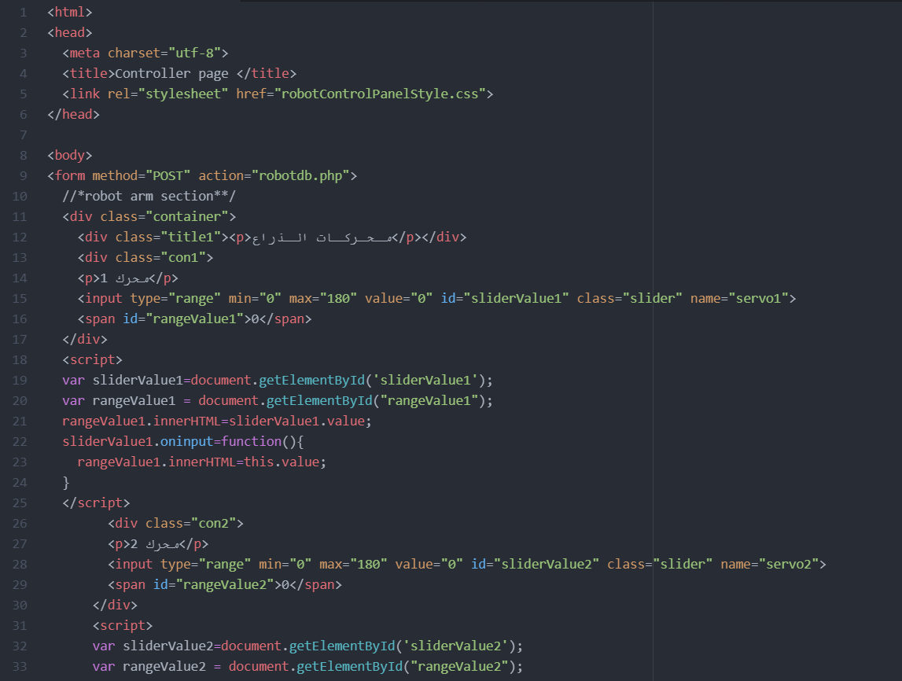

# * Control Panel for fencing Robot * 

This repository is about an interface to control a fencing robot.

 ## Description 

This project is an interface of a control panel made to move fencing robot arm and base.

There are four pages in this repository and a database

#### 1. robotConntrolPanel.html:
 
This page include the code for html, there are 2 section in the code one to control the arm and the other one is to control the base of the robot.
*The robot arm section:
There are 6 servo to control the arm of the robot thats why there are 6 range sliders, each slider has values that ranges between 0 and 180, also there is two buttons one for saving the values from the range sliders to the database at mySQL and the other is to display the values in seprate page.

*The robot base section:
There are 5 buttons each button move the base to sepcific direction and the the direction is saved to the database.

