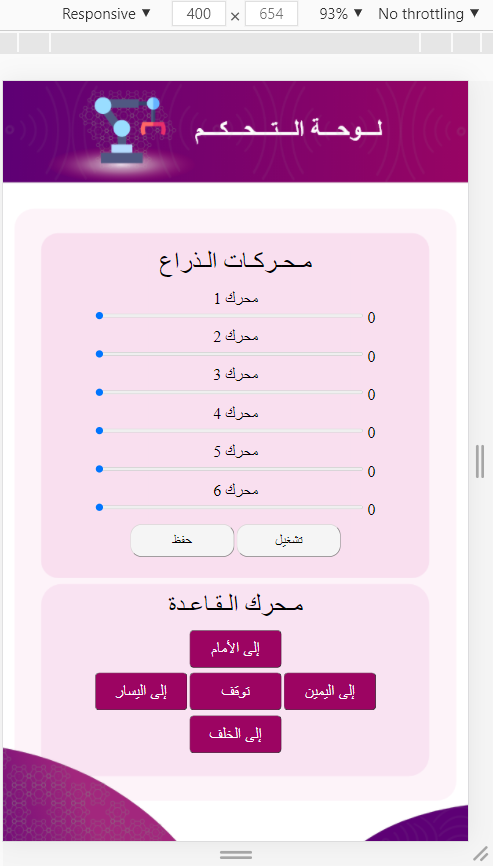
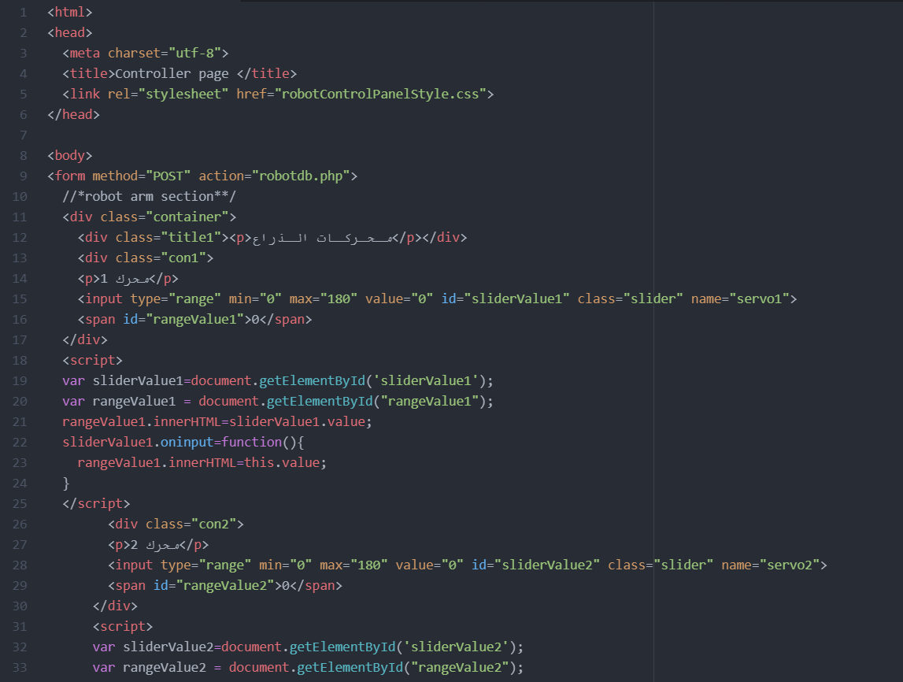
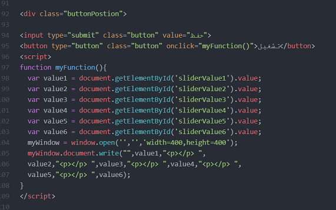
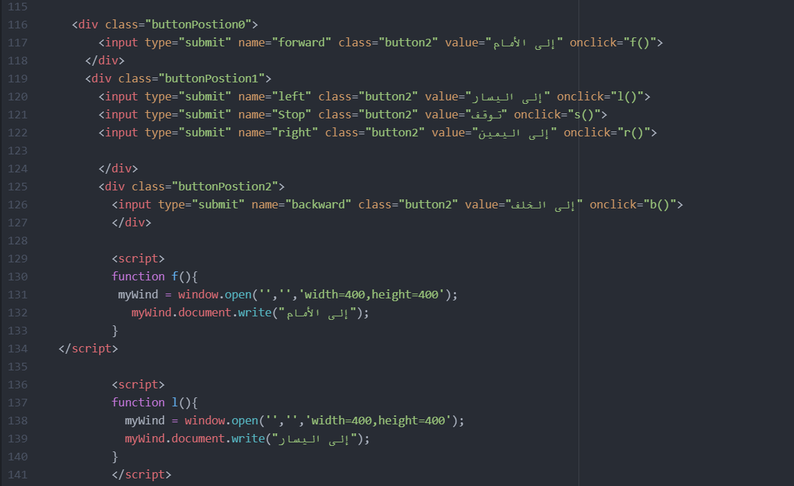
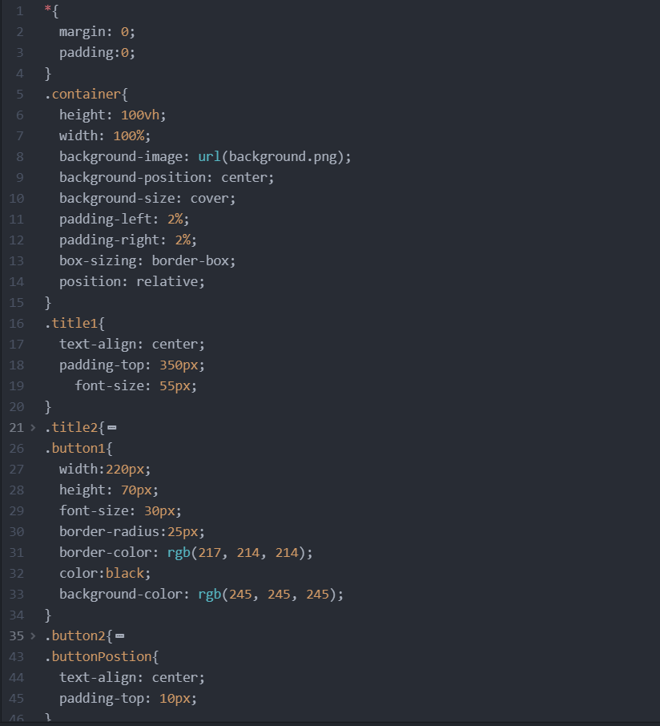
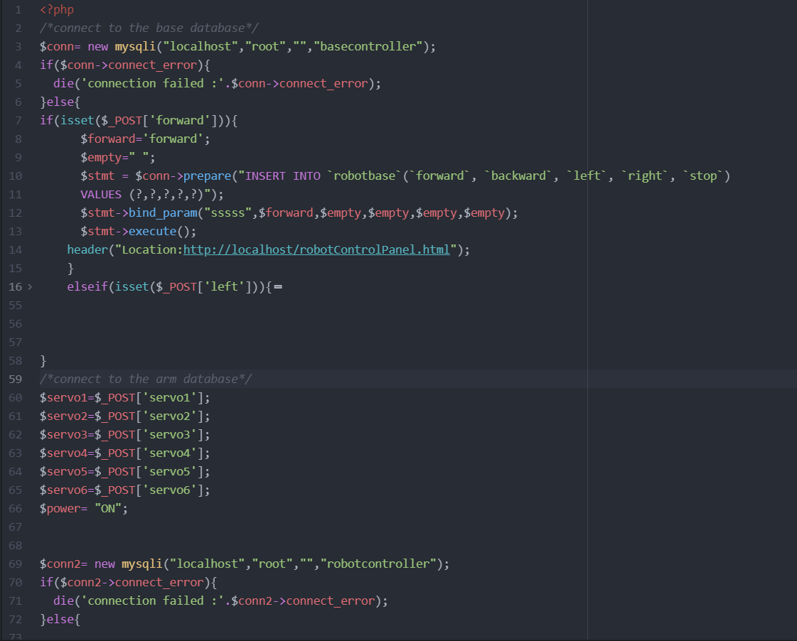
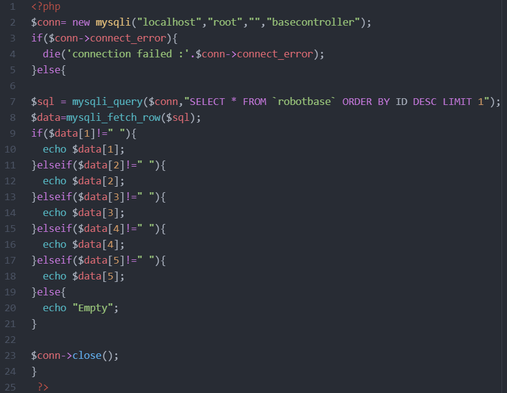
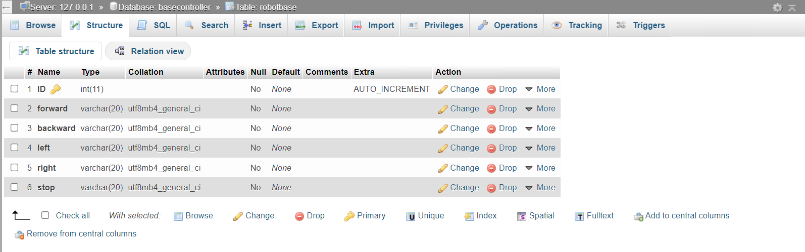

# * Control Panel for fencing Robot * 

This repository is about an interface to control a fencing robot.

 ## Description 

This project is an interface of a control panel made to move the fencing robot arm and base.

There are four pages in this repository and two databases

#### 1. robotConntrolPanel.html:
 
This page includes the code for HTML, there are 2 sections in the code one to control the arm and the other one is to control the base of the robot.

* The robot arm section:

There are 6 servos to control the arm of the robot that's why there are 6 range sliders, each slider has values that range between 0 and 180, also there are two buttons one for saving the values from the range sliders to the database at MySQL and the other is to display the values in separate page.

* The robot base section:

There are 5 buttons each button moves the base in a specific direction and the direction is saved to the database.

#### 2. robotControlPanelStyle.css:

This page include the design of the elements on the html page like the background, fonts and the layout style.

#### 3. robotdb.php:

This page connects the values of the servos and the directions of the base to the databases.

#### 4. robotBaseLastRec.php:

This page retrieves the last row in the database of the robot base and displays it.

#### 5. robotcontroller.sql:

This is the robot arm database file.

#### 5. robotbase.sql:

This is the robot base database file.

